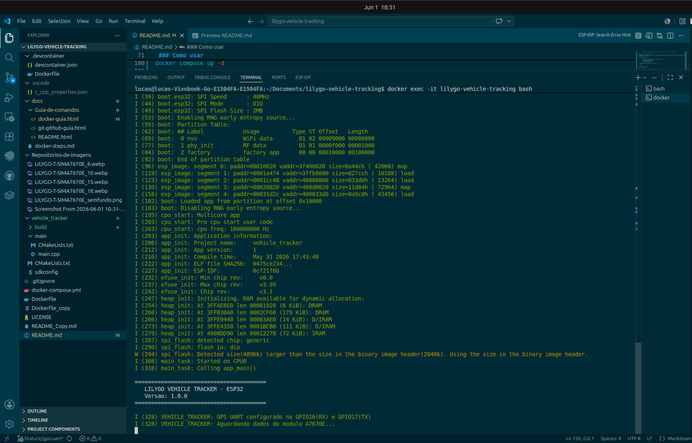

<style>
    .texto-formatado {
        text-indent: 2.5em;         /* Recuo na primeira linha do parágrafo */
        text-align: justify;        /* Alinha o texto perfeitamente nas laterais (esquerda e direita) */
        line-height: 1.6;           /* Espaçamento entre as linhas (evita que o texto fique espremido) */
        font-family: Arial, sans-serif; /* Muda a fonte para uma leitura mais limpa */
        font-size: 16px;            /* Define um tamanho confortável para leitura */
        color: #c1bbbb;             /* Um tom de cinza escuro, mais suave para os olhos do que o preto puro */
    }
</style>

<div align="center" markdown="1">
  
</div>

<h1 style="text-align: center; margin-top: 100px;">lilygo-vehicle-tracking</h1>

<div align="center">

<h2>SOBRE O PROJETO</h2>
<p class= "texto-formatado">
    Este projeto(MVP) é um <strong>rastreador veícular</strong> desenvolvido com a placa de desenvolvimento <strong>LILYGO T-A7670E</strong> (Esp32 + 4G + GPS Externo + Bateria). O objetivo deste projeto é demonstrar minha transição de carreira, unindo conhecimentos de Hardware aplicados na área de desenvolvimento de placas eletrônicas com <stroong>software web(backend Golang), banco de dados, API, microserviços</strong>
</p>
<p class= "texto-formatado">
    A placa Lilygo T-A7670E é um kit de desenvolvimento da prórpia empresa chinesa LilyGO, líder mundial P&D(Projeto & Desenvolvimento) em internet das coisas. Por possuir os quatro módulo essenciais de um rastreador veícular(Esp32 + 4G + GPS + Bateria), ter um hardware confiável e com muitas documentações de fábrica eu escolhi <strong>lilygo T-A7670E</strong> como sendo o hardware necessário para coletar dados de GPS e disponibilizar via API na web para fins de estudos e para fins profissionais para demoonstrar minhas habilidades em engenharia de software e tecnologias atuais.
</p>
<p class= "texto-formatado">
        O cerne deste projeto é, coletar dados GPS e envia-lo via API para a nuvem usando Golang como linguagem backend principal.
    A arquitetura do projeto compôe o firmware do Esp32 escrito em linguagem CPP(C++) a nível de Hardware para gerenciar a memória dinâmica do microcontrolador e também, gerir o barramento I2c de comunicação do GPS com o Esp32.
</p>

<p class= "texto-formatado">
    <strong>Diferencial deste projeto:</strong> Capacidade de entender os dois mundos - firmware embacado para o microcontrolador Esp32 escrito em C++, gerenciamento de memória dinâmica e velocidade de acesso a blocos internos do dispositivo. Este projeto demonstra a facilidade de trabalhar com barramnto I2C, um único fio condutor capaz de transmitir trens de dados em milésimos de sgundos. E backend escalável em Golang atrablahando com API e gerindo a publicação de dados GPS na web.
<p>

</div>

### Funcionalidades aplicadas a este projeto(MVP)

- [x] Ambiente Docker isolado para desenvolvimento (ubuntu 22:04)
- [x] Configuração do ESp32 
- [x] Build e flash automatizados com ESP-IDF
- [x] Firmware de teste para validação da placa lilygo T-A7670

### Tecnologias Utilizadas para o desenvolvimento deste MVP(Minimo produto viável)

| Componente | Tecnologia |
|------------|------------|
| **Hardware** | LILYGO T-A7670E (ESP32 + 4G + GPS) |
| **Firmware** | C++, ESP-IDF v5.3.5 |
| **Build System** | CMake, Ninja |
| **Container** | Docker, Docker Compose |
| **Versionamento** | Git, GitHub (SSH) |

### Àrvore de arquivos
```bash

lilygo-vehicle-tracking/
├── Dockerfile          # Configuração do container
├── docker-compose.yml  # Orquestração do container
├── .devcontainer/      # Configuração do VS Code no container
├── docs/               # Documentação(guia de comandos git/docker)
├── vehicle_tracker/    # Código fonte do ESP32
│ ├── main/main.cpp     # Código principal
│ ├── CMakeLists.txt    # Configuração de build
│ └── sdkconfig         # Configuração do ESP-IDF
└── README.md           # Este arquivo

```
 ### Como usar  

<div align="center">
<p class= "texto-formatado">
Para todas as branch deste repositório, é preciso subir o container <strong>lilygo-vehicle-tracking</strong>. È preciso também ter em mãos a placa  <a href="https://lilygo.cc/en-us/products/t-sim-a7670e?srsltid=AfmBOor6rdfBl_cieeBHlcDflmsB9XpvkZ3t6VhoQHLQuaOGv8QbgviG">LILYGO T-A7670</a> para poder abrir conexão com o container <strong>OU</strong> se apenas preferir navegar pelo projeto basta entrar no arquivo <strong>docker-compose.yml e comentar a linha 16 que diz respeito ao compartilhamente das portas do container com a máquina local(notebook, desktop..)</strong>
</p>

</div>

```bash 
devices:
      - "/dev/ttyACM0:/dev/ttyACM0"   # ← comentar esta linha para poder subir o container
```
<div>
<p class= "texto-formatado">
O projeto foi desenvolvido todo em sistema linux versão 26.04 resolute, mas caso esteja usando windows, basta instalar o WSL(Subsistema do Windows para Linux) para virtualizar o sistema linux
</p>
   <h3>Pré-requisitos</h3>
   <ul>
        <li>Instalar o docker Engine(não Docker Desktop)</li>
        <li>Placa lilygo T-A7670E</li>
        <li>Antena GPS ligada</li>
        <li>VSCode Instalado</li>        
   </ul>
   <h3>Comandos docker engine a serem usados.
</div>

```bash
# Abra o VSCode e abra um novo terminal(ctrl + j)

# 1. Iniciar o container
docker compose up -d

# 2. verificar se o container foi inicializado
docker ps # Ou 
docker ps -a #para ver todos os containers exisitentes

# 3. Entrar no container
docker exec -it lilygo-vehicle-tracking bash

# 4. Entrar na pasta do projeto e compilar o firmware
cd /workspace/vehicle_tracker && idf.py build

# 5. Gravar na placa
idf.py -p /dev/ttyACM0 flash

# 6. Monitorar a saída
idf.py -p /dev/ttyACM0 monitor

```

<div align="center" markdown="1">
    <h1>Saída</h1>
</div>


