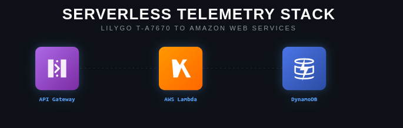

<div style="margin-top:80px; display: flex; justify-content:center "  >
  
</div>

<h1 style="text-align: center; margin-top: 100px;">AWS (Lambda + DynamoDB + API Gateway)</h1>

## Configuração da Infraestrutura AWS

<p style="text-indent: 2.5em;         
        text-align: justify;        
        line-height: 1.6;          
        font-family: Arial, sans-serif; 
        font-size: 16px;            
        color: #c1bbbb;  ">
    As instruções detalhadas neste roadmap para criação da conta AWS, configuração do DynamoDB, Lambda e API Gateway foram seguidas conforme orientações técnicas obtidas durante o desenvolvimento do projeto. Pode haver nuances no processo de criação da API seguindo este roadmap, então vale consultar a internet. A Amazon Cloud pede cartão de crédito para abertura de conta, mas só será cobrado após limite de requisição. Escolha o plano que mais lhe cair bem e para este proketo escolhi a arquitetura serverless por ser um serviço com várias camadas úteis evitando configuração manual. As imagens usadas neste documento são de orientações visuais e devem ser encaradas apenas para familiariazação coma plataforma AWS e não como guia de instruções.
</p>

<p style="text-indent: 2.5em;         
        text-align: justify;        
        line-height: 1.6;          
        font-family: Arial, sans-serif; 
        font-size: 16px;            
        color: #c1bbbb;  ">
    A relação entre esses três serviços é o coração do que chamamos de Arquitetura serverless(Sem servidor) na AWS. Eles funcionam como uma engrenagem sincronizada, onde cada um cuida de uma camada específica da aplicação(Rede, Processamento e Armazenamento).
</p>
<p style="text-indent: 2.5em;         
        text-align: justify;        
        line-height: 1.6;          
        font-family: Arial, sans-serif; 
        font-size: 16px;            
        color: #c1bbbb;  ">
    AWS API Gateway é a porta de entrada. Ele fica exposto para a internet esperando as requisições /POST do ESp32 ou /GET do navegador. Ele não processa regras de negócios e não guarda dados  pois sua única função é receber o cliente, validar a segurança(CROS) e direcionar a rota.
</p>


<p style="text-indent: 2.5em;         
        text-align: justify;        
        line-height: 1.6;          
        font-family: Arial, sans-serif; 
        font-size: 16px;            
        color: #c1bbbb;  ">
AWS Lambda é o cérebro do sistema pois quando o API Gateway recebe uma requisição, ele "acorda" a Lambda e entrega o pacote de dados. O cógio escrito em Golang roda dentro da Lambda, ela interpreta a rota(/POST/GET), trata os dados e apaga assim que termina de rodar por que a Lambda é volátil.Então ela precisa persistir os dados para consulta de histórico. 
</p>

<p style="text-indent: 2.5em;         
        text-align: justify;        
        line-height: 1.6;          
        font-family: Arial, sans-serif; 
        font-size: 16px;            
        color: #c1bbbb;  ">
AWS DynamoDB é o banco de dados NoSQl, a Lambda conecta com o DynamoDB para salvar o pacote recebido(PutItem) ou para consultar o histórico já armazenado(Scan). Ele apenas guarda e entrega as informações quando a Lambda solicita.
</p>

<p style="text-indent: 2.5em;         
        text-align: justify;        
        line-height: 1.6;          
        font-family: Arial, sans-serif; 
        font-size: 16px;            
        color: #c1bbbb;  ">
</p>
### Recursos Criados


| Serviço     | Nome                         | Região               |
|-------------|------------------------------|----------------------|
| DynamoDB    | VehiclesPositions            | us-east-2            |
| Lambda      | VehicleTelemetryReceiver     | us-east-2            |
| API Gateway | VehicleTelemetryReceiver-API | us-east-2            |

**Endpoint da API:**

https://g1rwfyb8el.execute-api.us-east-2.amazonaws.com/default/VehicleTelemetryReceiver


## Overview

| Etapa | Ação no Console AWS | Por que isso é importante? |
|-------|---------------------|----------------------------|
| **1. Criar o Recurso** | Navegar até `API Gateway` → `Create API` → `HTTP API` | As APIs HTTP são modernas, de baixo custo e perfeitas para comunicação entre dispositivos IoT |
| **2. Configurar o Backend** | Adicionar uma integração com a função Lambda `VehicleTelemetryReceiver` | Este é o **coração da API**. A integração conecta o endpoint público à sua lógica de negócio em Go |
| **3. Definir Rotas e Estágios** | Aceitar as rotas e estágios padrão (`$default`) criados automaticamente | As **rotas** determinam o que acontece quando uma URL é chamada. O **estágio** é a versão "no ar" da sua API |
| **4. Obter o Endpoint** | Copiar a URL de invocação da API após a criação | Esta é a **porta de entrada** para o mundo externo. É o endereço que seu ESP32 e seu navegador usam para se comunicar com o backend |

## Passo 1: Acesse e crie a função Lambda

- Criar uma conta na AWS: [https://us-east-2.console.aws.amazon.com/console/home?region=us-east-2](https://us-east-2.console.aws.amazon.com/console/home?region=us-east-2)

- No campo de pesquisa do lado superior esquerdo, procure por Lambda, DynamoDB e API Gateway.


- Acesse o Console AWS (us-east-2) e localize o serviço Lambda.


- Clique no botão **"Create function"**.

- Na tela de criação, selecione a opção **"Author from scratch"**.

- Preencha os campos:
    - **Function name:** `vehicleTelemetryReceiver` (ou o nome que você usou)
    - **Runtime:** Selecione **`provided.al2023`** (Amazon Linux 2023)
    - **Architecture:** `x86_64`
    - Em **"Permissions"**, escolha ou crie uma role (permissão) com acesso ao DynamoDB
    - Clique em **"Create function"**

## Passo 2: Compile seu código Go localmente

Abra o terminal na pasta onde está seu arquivo `main.go`.

```bash
# GOOS=linux GOARCH=amd64: Compila para o sistema operacional Linux e arquitetura x86_64 do Lambda
GOOS=linux GOARCH=amd64 go build -o bootstrap main.go

# -o bootstrap: É fundamental dar ao arquivo o nome "bootstrap"
``` 

## Crie o pacote .zip:

```bash 
zip function.zip bootstrap
# Isso criará o arquivo function.zip que contém o seu executável.
```

## Passo 3: Faça o upload do código na Lambda

- Na página da sua função Lambda, vá até a aba "Code".
- Do lado direito, localize o botão "Upload from" e selecione ".zip file".
- Selecione o arquivo .zip que você gerou.


## Passo 4: Configure o Handler

- Ainda na aba "Code", role a página para cima e localize "Runtime settings".
- Clique em "Edit".
- No campo "Handler", coloque bootstrap.
- Marque a arquitetura x86_64.
- Clique em "Save".

Após esses passos, sua função Lambda Go estará criada e configurada com o código mais recente.


## DynamoDB.

- No painel AWS, no canto superior esquerdo, digite no campo de busca o banco de dados DynamoDB da mesma forma que procurou a Lambda. Na imagem a baixo mostra o dashboard do DynamoDB e ao lado esquerdo clique em "tables".


- Clique em "Create Table".
- Table name: VehiclePositions - Exatamente como está no código GO  ``` var tableName = "VehiclePositions" ```.
- Partition key: Digite vehicle_id e selecione o tipo String .
- Sort key: Digite timestamp e selecione o tipo String .


- Role a tela até o final e clique no botão "Create table" .


- O DynamoDB criará a tabela e a disponibilizará em alguns segundos.

## API Gateway(A porta de entrada).

<p style="text-indent: 2.5em;         
        text-align: justify;        
        line-height: 1.6;          
        font-family: Arial, sans-serif; 
        font-size: 16px;            
        color: #c1bbbb;  ">

O ```Amazom API Gateaway ``` é um serviço da AWS que atua como um ```porteiro``` ou ```recepsionista``` para a aplicação, pois ela recebe requisições HTTP/HTTPS do mundo externo(ESP32, navegador, etc). Roteia as requisições para o serviço correto(sua Lmbda). Ela também gerencia autenticação, limites de taxas, CORS, etc..E por fim roteia as respostas para o cliente.
</p>
<p style="text-indent: 2.5em;         
        text-align: justify;        
        line-height: 1.6;          
        font-family: Arial, sans-serif; 
        font-size: 16px;            
        color: #c1bbbb;  ">
    Na tela abaixo mostra o caminho que deve ser seguido para receber a URL pública gerada pela API Gateway. Segue um breve roadmap para preencher os campos corretos até a geração da url. Vale pesquisar na internet por atualizações pois este roadmap pode ter mudado com o tempo.
</p>

- Acesse o Console do AWS e localiza no campo de pesquisa o nome API Gateway.
- No canto esquerdo clique em "APIs".
- Localiza "HTTP API" esta é a escolha mais simples, barata e perfeita para este projeto, pois lida bem com o alto volume de dados do ESP32, diferentemente de uma API REST, que é mais complexa e cara. Em Seguida clica em "build".
- Dê um nome para sua API.
- Para configurar a integração. Na seção "integration" escolha "Lambda" e em version escolha 1.0.
- Em lambda function, clica na única opção que surgir, para este projeto irá mostrar "VehicleTelemetryReceiver".
- Dado um nome para sua API, como my-http-api ou similar, e prosseguiu com as configurações padrão.
- O API Gateway criou automaticamente uma rota (route) $default para encaminhar qualquer requisição para sua Lambda, e um estágio (stage) chamado $default para disponibilizar a API .
- Ao clicar em "Create" , sua API foi criada e uma URL pública (como https://g1rwfyb8el.execute-api.us-east-2.amazonaws.com) foi gerada para você .


### Quando finalizar, aparecerá no console do AWS em "Function Overview" a API Gateway com o link da URL disponível para consulta dos dados em qualquer navegador.

