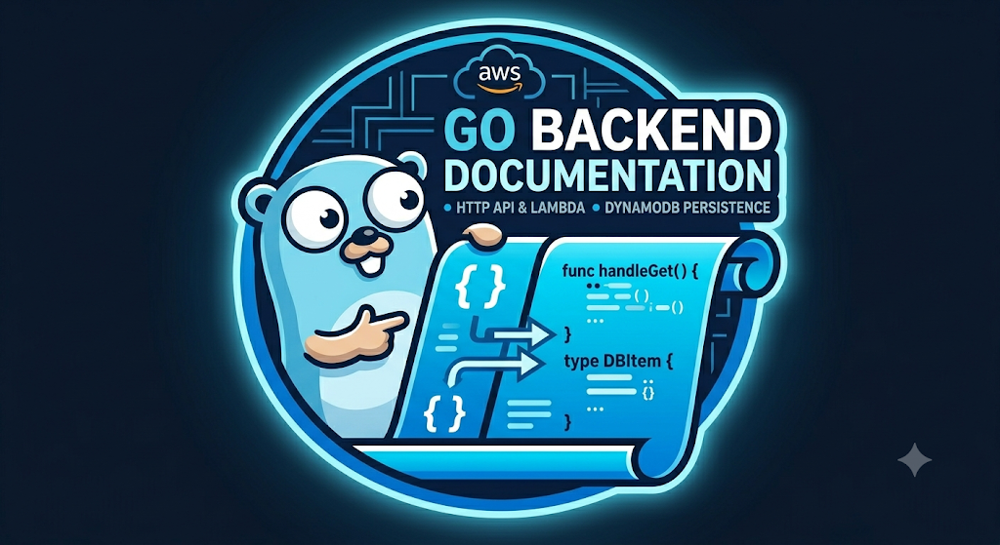

<style>
    .texto-formatado {
        text-indent: 2.5em;         /* Recuo na primeira linha do parágrafo */
        text-align: justify;        /* Alinha o texto perfeitamente nas laterais (esquerda e direita) */
        line-height: 1.6;           /* Espaçamento entre as linhas (evita que o texto fique espremido) */
        font-family: Arial, sans-serif; /* Muda a fonte para uma leitura mais limpa */
        font-size: 16px;            /* Define um tamanho confortável para leitura */
        color: #c1bbbb;             /* Um tom de cinza escuro, mais suave para os olhos do que o preto puro */
    }
</style>

<div style="margin-top:80px; display: flex; justify-content:center "  >
  
</div>


<h1 style="text-align: center; margin-top: 100px;">BACKEND(GO)</h1>
<h3 style="text-align: center; margin-top: 50px;">git clone git@github.com:GitHubAlves150/lambda_project.git</h3>


## Backend(Lambda em Golang).

<p class= "texto-formatado">
    O componente backend foi desenvolvido em Golang e implantado como função AWS Lambda sod arquitetura <strong>serverless</strong>. A Lambda atua como motor lógico central da aplicação, sendo responsável por processar e persisitir os dados enviados pelo dispositivo lilygo, além de disponibilizar esses dados para consumo externo atráves de uma API REST.
</p>

## Responsabilidades do backend
<p class= "texto-formatado">
    O roteamento interno utiliza uma única função manipuladora(handler) que inspeciona o método HTTP da requisição(GET ou POST), eliminando a necessidade de gerenciar múltiplas funções Lambda separadas. O Lambda recebe o pacote de dados do dispositivo em formato JSON, valida a estrutura, gera uma carimbo de data/hora chamado timstamp no padrão RFC3339 e injeta o registro no banco de dados DynamoDB. 
</p>

<p class= "texto-formatado">
    Após isto o Lambda realiza uma varedura(Scan) na tabela do Dynamo para coletar o histórico de posições enviadase responde(GET) no formato de um array JSON estruturado. O suporte CORS integrado no Lambda retorna os cabeçalhos de controle de origem<strong>(Acces-Control-Allow-origen: *)</strong> necessários para que qualquer aplicação frontend em execução em um navegador consiga consumir a API sem bloqueios de segurança.
</p>

## Estrutura de dados e modelagem
<p class= "texto-formatado">
    O código mapeia os dados utilizando estruturas nativas do GO com tags especificas para conversão automática de JSON e atributos do DynamoDB.
</p>


```go
// Representa os dados brutos de telemetria recebidos via POST do ESP32
type TelemetryData struct {
	VehicleID string  `json:"vehicle_id"`
	Latitude  float64 `json:"latitude"`
	Longitude float64 `json:"longitude"`
	Speed     float64 `json:"speed"`
}

// Representa a estrutura idêntica do item gravado/lido na tabela do DynamoDB
type DBItem struct {
	VehicleID string  `json:"vehicle_id" dynamodbav:"vehicle_id"` // Chave de Partição
	Timestamp string  `json:"timestamp"  dynamodbav:"timestamp"`  // Chave de Ordenação
	Latitude  float64 `json:"latitude"   dynamodbav:"latitude"`
	Longitude float64 `json:"longitude"  dynamodbav:"longitude"`
	Speed     float64 `json:"speed"      dynamodbav:"speed"`
}

``` 
## A função handler e sua lógica de funcionamento

<p class= "texto-formatado">
    O código abaixo mostra a task handler gerenciando as requições GET/POST/OPTIONS e logo abaixo do código o diagrama de fluxo da lógica do handler.
</p>

```bash
func handler(ctx context.Context, request events.APIGatewayProxyRequest) (events.APIGatewayProxyResponse, error) {
	// Roteamento baseado no método HTTP
	switch request.HTTPMethod {
	case "GET":
		return handleGet(ctx)
	case "POST":
		return handlePost(ctx, request)
	case "OPTIONS": // Necessário para o "pre-flight" do CORS no navegador
		return events.APIGatewayProxyResponse{StatusCode: 200, Headers: corsHeaders}, nil
	default:
		return events.APIGatewayProxyResponse{
			StatusCode: 405,
			Headers:    corsHeaders,
			Body:       `{"error": "Method Not Allowed"}`,
		}, nil
	}
}
```

```bash

                                                    ┌───────────────────────────┐
                                                    │ Requisição do API Gateway │
                                                    └─────────────┬─────────────┘
                                                                  │
                                                                  v
                                                    🔬 switch request.HTTPMethod
                                                                  │
                                            ┌─────────────────────┼──────────────────────┐
                                            ▼ (POST)              ▼ (GET)                ▼ (OPTIONS)
                                    [Recebe do ESP32]      [Acesso via Navegador]    [Pre-flight do CORS]
                                            │                     │                       │
                                    Unmarshal JSON         Scan no DynamoDB          Retorna Status 200
                                    Gera UTC Timestamp            │                   Com Headers CORS
                                    PutItem no DynamoDB    Unmarshal Lista                │
                                            │               Retorna JSON Array            │
                                            ▼                      ▼                      ▼
                                    Retorna Status 200     Retorna Status 200     Retorna Status 200

``` 

## Método POST(Injeta os dados na nuvem)

<p class= "texto-formatado">
    A Lambda recebe o corpo de text enviado pelo dispositivo( chip ESP32), faz p <strong>unmarchal</strong>(conversão de texto para objeto GO) e monta o ```bash DBItem```. A função se conecta ao banco de dados usando o <strong>AWS SDK para GO</strong> e executa um ```bash PutItem ``` de forma síncrona. 
</p>

## Método GET(Consulta dos dados via API REST - navegador)

<p class= "texto-formatado">
    O backend dispara uma operação Scan limitada na tabela ```bash VehiclesPositions```. Os dados brutos NoSql são convertidos para uma lista de structs através da função ```bash dynamodbattribute.UnmarchalListOfmaps```. A lista é convertida em JSON e enviada como resposta com status 200 ok.
</p>

## Método OPTIONS(handshake)
<p class= "texto-formatado">
    Intercepta requisições automáticas que os navegadores fazem antes do envio de dados reais(pre-flight), respondendo imediatamente com as permissões de CORS liberadas para que a aplicação HTML funcione perfeitamente.
</p>


## Compilação e deploy do código GO no Lambda
<p class= "texto-formatado">
     Como o AWS Lambda executa em um amiente Linux gerenciado, o binário em GO precisa ser compilado de forma estática, sem dependência externas local, e renomeado obrigatóriamente como <strong>bootstrap</strong> para o ambiente customizado da AWS.<br>
     Resumindo! O editor do Lambda não gera arquivos executaveis, por isso deve ser compilado localmente e subir o arquivo zipado e nomeado obrigatóriamente como <strong>bootstrap</strong>.
</p>

## Como compilar
<p class= "texto-formatado">
Abra um terminal do linux na sua máquina(CTRL + ALT + t) ou o prórpio terminal do VSCode (CTRL + j), entre na pasta do projeto e execute o primeiro código do painel abaixo. Este código irpa compilar e criar um executável chamdo bootstrap. Em seguida compacta este arquivo executando o último código da lista.
</p>

```bash
# 1. Compila o programa forçando o alvo para Linux de 64 bits (arquitetura padrão da AWS)
GOOS=linux GOARCH=amd64 CGO_ENABLED=0 go build -o bootstrap main.go

# 2. Compacta o binário executável gerado em um arquivo de desdobramento ZIP
zip deployment.zip bootstrap

``` 
 ## Como subir o arquivo bootstrap no Lambda
<p class= "texto-formatado">
    Neste arquivo <strong>BASCKEND.md</strong> está documentado incialmente os pontos importantes do código em GO que manipula as rotas, monta e disponibiliza um array JSON com coordenadas GPS. No arquivo <strong>LAMBDA_PRJ.md</strong> tem um bbreve roadmap de como trabalhar com AWS + Lambda + DynamoDB.
<p>
