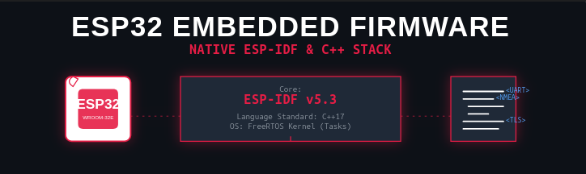

<style>
    .texto-formatado {
        text-indent: 2.5em;         /* Recuo na primeira linha do parágrafo */
        text-align: justify;        /* Alinha o texto perfeitamente nas laterais (esquerda e direita) */
        line-height: 1.6;           /* Espaçamento entre as linhas (evita que o texto fique espremido) */
        font-family: Arial, sans-serif; /* Muda a fonte para uma leitura mais limpa */
        font-size: 16px;            /* Define um tamanho confortável para leitura */
        color: #c1bbbb;             /* Um tom de cinza escuro, mais suave para os olhos do que o preto puro */
    }
</style>


<div style="margin-top:80px; display: flex; justify-content:center "  >
  
</div>

<h1 style="text-align: center; margin-top: 100px;">Firmware ESP-IDF</h1>


## Firmware.

<p class= "texto-formatado">
    O firmware é um programa que pode se dizer backend, quando a interface se trata de um hardware. Por exemplo! display é uma interface pois mostra as informações para o usuário. Botoeiras também é um tipo de interface, pois os botões nos dão opções de escolha para configuração e controle do dispositivo. Resumindo! interface é qualquer componente que nos dê alguma informação ou que nos dê acesso e controle de informações, ou seja Display ou leds é o monitor e botoeiras é o teclado do computador. Assim como todo computador tem seu S.O(windows, linux ou MAC) microcontroladores e processadores também precisam ser configurados e inicializados, autenticação de assesso na rede etc... 
</p>
<p class= "texto-formatado">
    A placa lilyGo T-A7670 é um dispositivo desenvolvido pela empresa chinesa Lilygo, lider e referência mundial em "devices IoT". Esta placa contém como cérebro o chip ESP32 da empresa chinesa Espressif, dentro de um módulo chamado ESP32-Wroom v5.3. Este microcontrolador tem pinos de leitura e escrita(I/O). Além do ESP32 a lilygo T-A7670 comporta outros componentes de periféricos como o modem A7670, o módulo GPS L76K da Quecteel, suporte a bateria, slot de cartão SD-CARD para gravação de logs e configuração JSON, slot para SIM-CARD para cobertura 4G movél. A baixo está a descrição dos arquivos que realizam toda a infra deste dispositivo para enviar os dados para a nuvem.
</p>

## Infraestrutura dos arquivos de construção do firmware.
Baixar o repositório ```bashgit clone git@github.com:GitHubAlves150/lilygo-vehicle-tracking.git ``` 

```bash
lilygo-vehicle-tracking/
├── README.md                          # Visão geral do projeto
├── docs/
│   ├── FIRMWARE.md                    # Documentação principal do firmware
│   ├── API_REFERENCE.md               # Referência das funções principais
│   ├── HARDWARE_SETUP.md              # Setup do hardware (pinos, conexões)
│   └── DEPLOYMENT.md                  # Como compilar e gravar
└── main/
    ├── include/
    │   ├── gps_parser.h               # Comentários Doxygen
    │   ├── hardware.h
    │   ├── modem.h
    │   └── wifi_init_.h
    └── src/
        ├── gps_parser.cpp             # Comentários detalhados
        ├── hardware.cpp
        ├── modem.cpp
        └── wifi_init_.cpp

``` 
## 📌 Visão Geral

```bash
O firmware é responsável por:
1. Coletar dados do GPS via UART (sentenças NMEA)
2. Processar e extrair coordenadas (latitude, longitude, velocidade)
3. Conectar ao WiFi e enviar dados para AWS via HTTPS
4. Gerenciar tasks paralelas usando FreeRTOS

``` 
## 🎯 Especificações Técnicas

```bash
| Parâmetro      | Valor                          |
|----------------|--------------------------------|
| **Plataforma** | ESP32 (dual-core, 240MHz)      |
| **Framework**  | ESP-IDF v5.3.5                 |
| **Linguagem**  | C++17                          |
| **RTOS**       | FreeRTOS                       |
| **GPS**        | Quectel L76K (9600 baud, NMEA) |
| **WiFi**       | 2.4GHz, WPA2/WPA3              |
| **Comunicação**| HTTPS (TLS 1.2/1.3)            |


```

## 📁 Estrutura de Arquivos

```bash

| Arquivo                   | Responsabilidade                                  |
|---------------------------|---------------------------------------------------|
| `main.cpp`                | Entry point (`app_main`), inicialização das tasks |
| `gps_parser.cpp/h`        | Leitura UART, parsing NMEA, envio para AWS        |
| `hardware.cpp/h`          | Inicialização dos pinos e alimentação da placa    |
| `modem.cpp/h`             | Task para monitorar o modem 4G                    |
| `wifi_init_.cpp/h`        | Conexão WiFi e gerenciamento de rede              |

```

## 🔌 Pinagem

```bash

| Componente    | Pino ESP32  | Função                |
|---------------|-------------|-----------------------|
| **GPS L76K**  | GPIO21 (RX) | Dados NMEA            |
| **GPS L76K**  | GPIO22 (TX) | Comandos (não usado)  |
| **Modem 4G**  | GPIO26 (TX) | Comandos AT           |
| **Modem 4G**  | GPIO27 (RX) | Respostas AT          |
| **Power On**  | GPIO12      | Alimentação principal |
| **Modem PWR** | GPIO4       | Liga/desliga modem    |
| **Reset**     | GPIO5       | Reset do sistema      |

```

## 🔄 Fluxo de Dados
<p class= "texto-formatado">
    O fluxo de dados abaixo demonstra a coleta de dados feito pelo módulo e sensor GPS L76K e enviado através do barramento UART com velocidade de 9600 bit por segundo até o módulo ESP32. Em seguida o ESP32 faz um handshake com a rede enviando os dados em formato JSON via HTTPS. A AWS Gateway após receber a requisição do esp32 ele envia o pacote direto para o lambda pela rota "/ANY", e o lambda em GO fa o roteamento interno.
</p>

```bash

[GPS L76K] ──UART(9600)──> [ESP32] ──HTTPS──> [AWS Lambda] ──> [DynamoDB]
│
├── Parsing NMEA
├── Extrai lat/lon/speed
└── Envia via WiFi

```  

## 📡 Protocolo de Comunicação (HTTPS)

### Requisição enviada pelo ESP32
<p class= "texto-formatado">
Dentro do arquivo gps_parser.cpp o JSON é montado manualmente para envio via HTTPS.
</p>

```bash
# URL da API (definida no código)
static const char *API_URL = "https://g1rwfyb8el.execute-api.us-east-2.amazonaws.com/default/VehicleTelemetryReceiver";

#Constrói o JSON manualmente
char json_buffer[256];
snprintf(json_buffer, sizeof(json_buffer),
         "{\"vehicle_id\":\"%s\",\"latitude\":%.6f,\"longitude\":%.6f,\"speed\":%.1f}",
         vehicle_id, lat, lon, speed);  // ← valores do GPS

# No monitor serial(idf.py -p /dev/ttyACM0 monitor) a saída tem esta representação
📤 Enviando para AWS: {"vehicle_id":"lilygo-vehicle-tracking","latitude":-27.599908,"longitude":-48.508762,"speed":0.0}

``` 

<p class= "texto-formatado">
O arquivo gps_parser.cpp compôe três grandes pilares lógicos coordenados.
</p>

```bash
    1. Captura de dados por Hardware(gps_task)
    2. Filtragem e tratamento Geográfico(parse_nmea_gprmc)
    3. Transmissão Criptografada e Segura(enviarDadosGPS)
```

## 1. Captura de Dados por Hardware (gps_task)

<p class= "texto-formatado">
A execução começa com a inicialização da porta serial UART. O ESP32 configura a taxa de transmissão em 9600 baud (padrão do módulo Quectel L76) e atrela os pinos físicos de recepção e transmissão.

    Sincronismo Inicial (Boot Test): Antes de entrar no laço infinito, a tarefa roda um laço de espera (timeout) monitorando o status da rede. Assim que o Wi-Fi obtém uma atribuição de IP válida, o firmware dispara um payload fixo (teste_boot) para o API Gateway. Isso serve como um validador de diagnóstico para garantir, logo no ligamento, que as rotas de nuvem e as chaves do DynamoDB estão operacionais.

    Streaming de Bytes: Dentro do laço while(1), o chip lê continuamente os bytes brutos que chegam do módulo GPS. Como esses dados chegam espalhados na memória, o código armazena caractere por caractere dentro de um buffer local (line_buffer). Ao detectar um caractere de quebra de linha (\n ou \r), o algoritmo entende que uma sentença de texto NMEA completa foi recebida, adiciona o terminador nulo (\0) e envia essa linha para processamento.

</p>

## 2. Filtragem e Tratamento Geográfico (parse_nmea_gprmc)
<p class= "texto-formatado">
O módulo GPS gera dezenas de linhas por segundo (GPGGA, GPGSA, GPGSV, etc.). A lógica deste arquivo foca estritamente na sentença RMC (Recommended Minimum Navigation Information), que contém o pacote essencial de localização.

    Validação do Sinal: O código usa sscanf para quebrar a string NMEA separada por vírgulas em variáveis estruturadas. Ele checa o caractere de status: se for 'A' (Active), os dados são confiáveis; se for 'V' (Void), o algoritmo ignora o pacote e exibe o aviso de que o GPS está buscando sincronismo com os satélites.

    Conversão de DDMM.MMMM para Graus Decimais: Os módulos GPS enviam a latitude e longitude no formato de minutos de arco. Para que esses pontos sejam plotados futuramente em mapas digitais (como Google Maps ou Leaflet), a lógica calcula matematicamente a conversão: isola os graus inteiros, divide os minutos por 60.0 e soma ambos. Além disso, ele checa os caracteres de hemisfério (S para Sul e W para Oeste) para aplicar o sinal negativo de geolocalização cartesiana.

    Conversão de Velocidade: A velocidade original do satélite vem em Nós (knots). O algoritmo multiplica o valor bruto por 1.852 para convertê-lo na unidade métrica de km/h. Após consolidar as variáveis na estrutura global current_gps, a função de envio para a rede é chamada.
</p>


## 3. Transmissão CRiptografada e Segura(enviarDadosGPS)

<p class= "texto-formatado">
Esta função é a ponte de saída do ecossistema embarcado para a AWS. Ela foi projetada com proteções estritas contra transbordamento de rede e falhas de memória:

    Filtro de Inundação (Trava de Tempo): Utilizando variáveis estáticas de controle e a contagem de ticks do FreeRTOS (xTaskGetTickCount), a função calcula o intervalo temporal desde o último envio. Se menos de 5 segundos tiverem se passado, a transmissão é abortada. Isso poupa processamento do ESP32 e evita consumo desnecessário na arquitetura Serverless da AWS.

    Handshake TLS com Certificado Embutido: Como o API Gateway da AWS exige conexões seguras (https://), a requisição HTTP precisa passar por criptografia SSL/TLS. A lógica utiliza a diretiva config.crt_bundle_attach = esp_crt_bundle_attach, que instrui o driver nativo do ESP-IDF a usar sua tabela global de certificados raiz criptográficos (incluindo a autoridade da Amazon) para fechar o canal seguro sem que o desenvolvedor precise gerenciar chaves manualmente no código.

    Disparo e Limpeza de Memória: O payload JSON é gerado dinamicamente através de um snprintf. O cliente HTTP define o cabeçalho como application/json, vincula o corpo da mensagem e executa a transmissão de forma síncrona. Ao obter a resposta do servidor, ele analisa o código HTTP (200/201 indica sucesso). Por fim, a função executa obrigatoriamente o esp_http_client_cleanup(), desalocando os buffers de rede da memória RAM para prevenir o travamento do chip por vazamento de memória (memory leak).
</p>